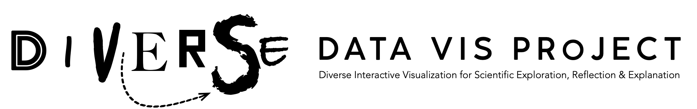

<link rel="stylesheet" type="text/css" href="../css/pages.css"/>

1. **Focus:** We study visualization in diverse forms in diverse contexts in diverse ways

- a thing
- another thing

2. **Objective:** We develop a supportive environment to undertake high quality research

3. **Approach:** We are critical, responsible, open, realistic and kind

4. **Funding:** We support each other by sharing funding, knowledge and resources

5. **Activity:** We share responsibility for initiatives, quality and profile

6. **Governance:** We decide collectively, we communicate frequently and openly

7. **Reporting:** We do not report, we are not burdened by a reporting structure

8. **Lifespan:** We decide who we are, how we operate and when to stop

9. **Participation:** We do our best to use and develop this manifesto to be productive, do good, be human and have fun as we learn and inform in ways that are collectively and individually fulfilling

---

Jason **DYKES** 
_27/10/23_ 🐁
