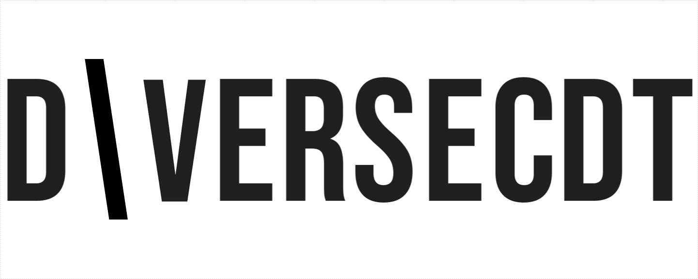
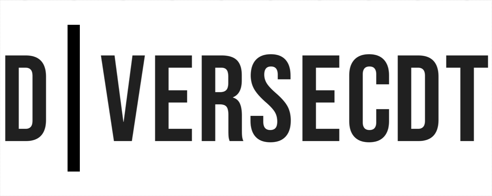
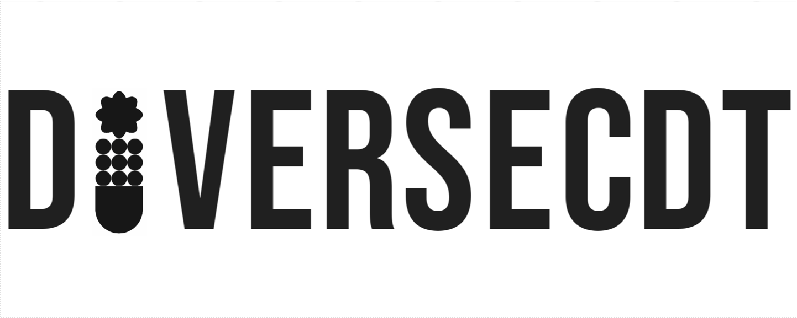
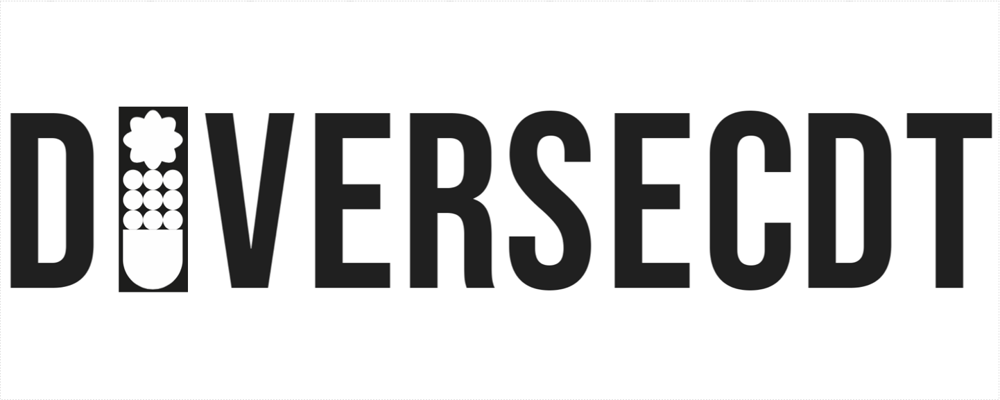
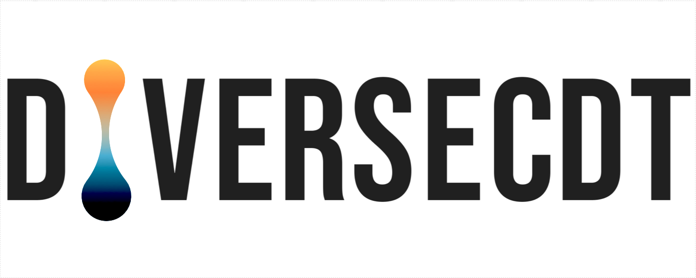
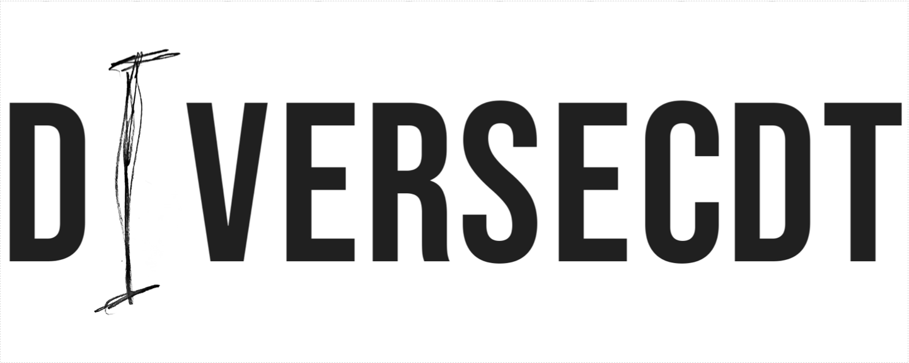
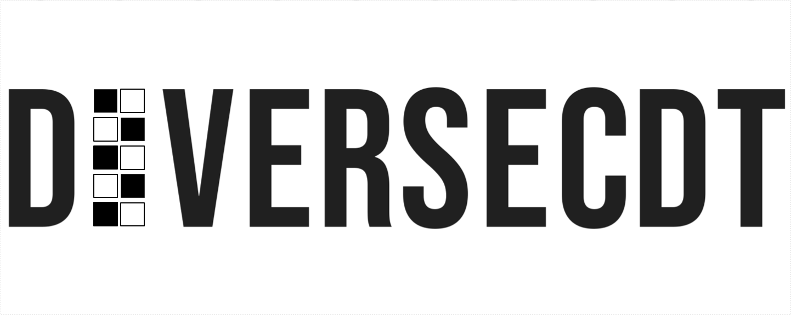
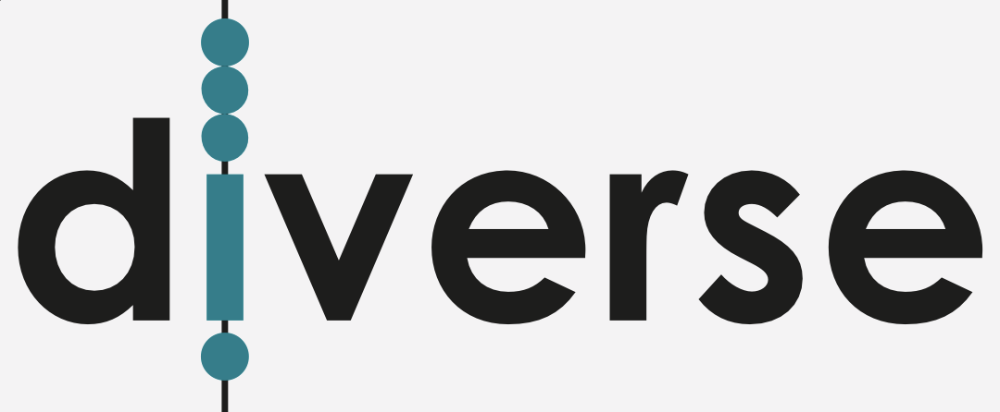
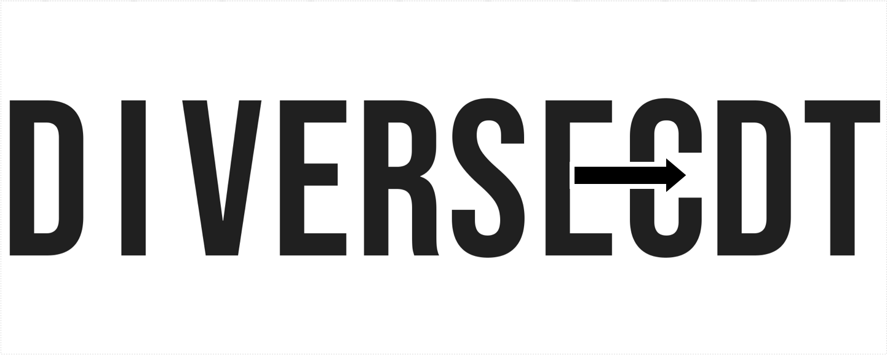
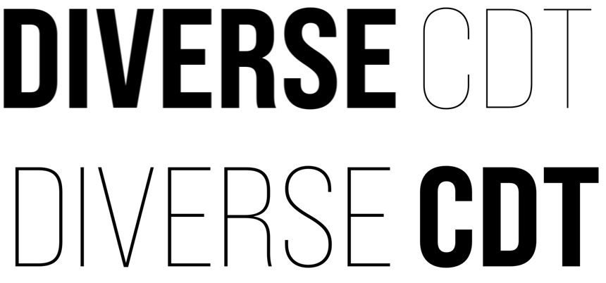

### DiVERSE-CDT Logo - DISCUSSION &amp; TEXT

<!-- #### TEXT -->

Nice discussion today, very useful to hear Ben's perspective and advice.

It seems pretty clear to me that the text itself is a very important part of the design, and identity, and that this may end up being used without the other graphic elements that we've been talking about.

Given this, it seems to me that this does need to have a distinctive identity and this could be quite subtle. We talked about the challenges with having an I fill a 2x1 space (to sit within the grid). And we have had some positive feedback on some of the examples in which one letter differs or is designed differently. This says 'diversity' but I am not sure it says 'inclusion'.

So could we try a re-designed **I** that has some character?

Of course, I couldn't help having a couple of ideas both in the meeting and on the way home. I'm trying to communicate them as clear as I can hear, to help Ben, as he comes up with our bold, innovative, funky, legible, text design!

So ... maybe change alignment?

 

 

 Or size?

 

Maybe we could use / re-hash some of the other styles that received positive feedback?

 

 

 

 Or maybe we just say '_bring your own I_' and allow anything that is:

  - between 1 and 3 cells high
  - centre aligned vertically and horizontally

Like this one that I scrawled in a _Creative Triangle_ notebook with a triangular _Creative Triangle_ pencil.

 

 That gives us another exciting, expressive design space!

 Do we want to do the same thing that we are doing with the grid - have 2 or 3 known alternatives that work and allow others?

 Or maybe we do something that reflects, points to, emphasizes, _the grid_ (that we anticipate appearing in the square logo design and subsequent design experiments) in some way ...

 

 

 

 

 

This gets us quite close to _Concept 6_ (the abacus) from _Design 8_, which nobody liked much. Maybe it was the teal, lower case and bounding box!  Maybe not!

 

Anyhow, I hope this inspires some ideas!

Oh, and finally, **hyphens** were mentioned in light of the visual _joke_ / _annoyance_ on the [DIVERSE CDT](https://diverse-cdt.ac.uk/) holding web site, which you might find a useful source of background information actually.

I thought we might manage another visual 'joke' with this ...

 

... or even this to retain the flow  ...

 

 ... but, I don't think they work particularly well.

I do however think that all of the above make it clear that we need to not say "**DIVER SECDT**" and I hope that Ben can work to avoid that by visually differentiating the two parts of the 'word'!

I'd quite like to see **weight variations** using the selected typeface, e.g.:

 

 These examples are not monospaced but if they were, the spaced D&nbsp;I&nbsp;V&nbsp;E&nbsp;R&nbsp;S&nbsp;E&nbsp; could look pretty cool!

---

**Jason**.
 _11/06/2025_
