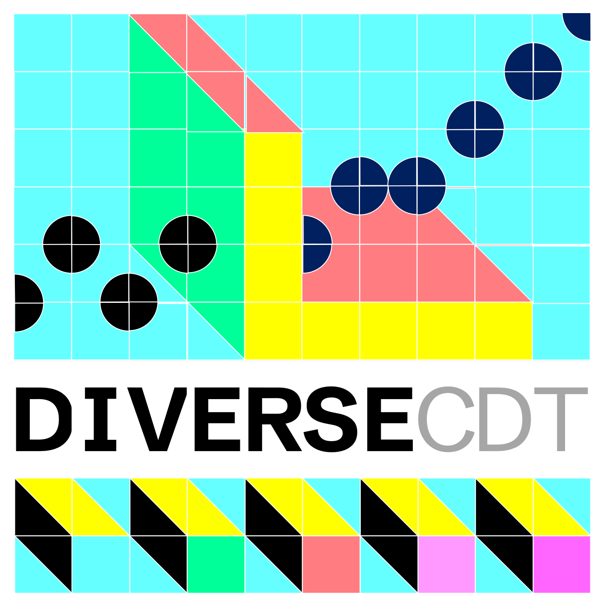

### DiVERSE-CDT Logo Grid - IDEAS &amp; REACTIONS

#### Jason

###### DISLIKE

I **like** this one a lot, which surprises me, but it shows how weak the lightness encoding is to dissociate DIVERSE and CDT, and I **DISLIKE** the lightness encoding used in the text. This design shows that it is easily compromised by other variation in the tiles.
We need different weights in our typeface family that enable us to dissociate DIVERSE from CDT in black and white only.  [Bebas Neue](https://fonts.google.com/specimen/Bebas+Neue) doesn't seem to have these.

So I **DISLIKE** the grey shading in the text here, the saturated hues and variation in lightness in the tiles cause visual conflict and compromise the dissociative properties of lightness.

###### LIKE

I **LIKE** this one as is seems to have flow.

But then I also like the various versions (such as the one above) where the tiles are more obvious.

I **dislike** the lightness encoding in the text (see above).

I **LIKE** black and white, which seems very flexible, and I **LIKE** the character spacing the balance of black to white (&lt; 25%) 

---

    
**Jason**.
 _09/06/2025_
