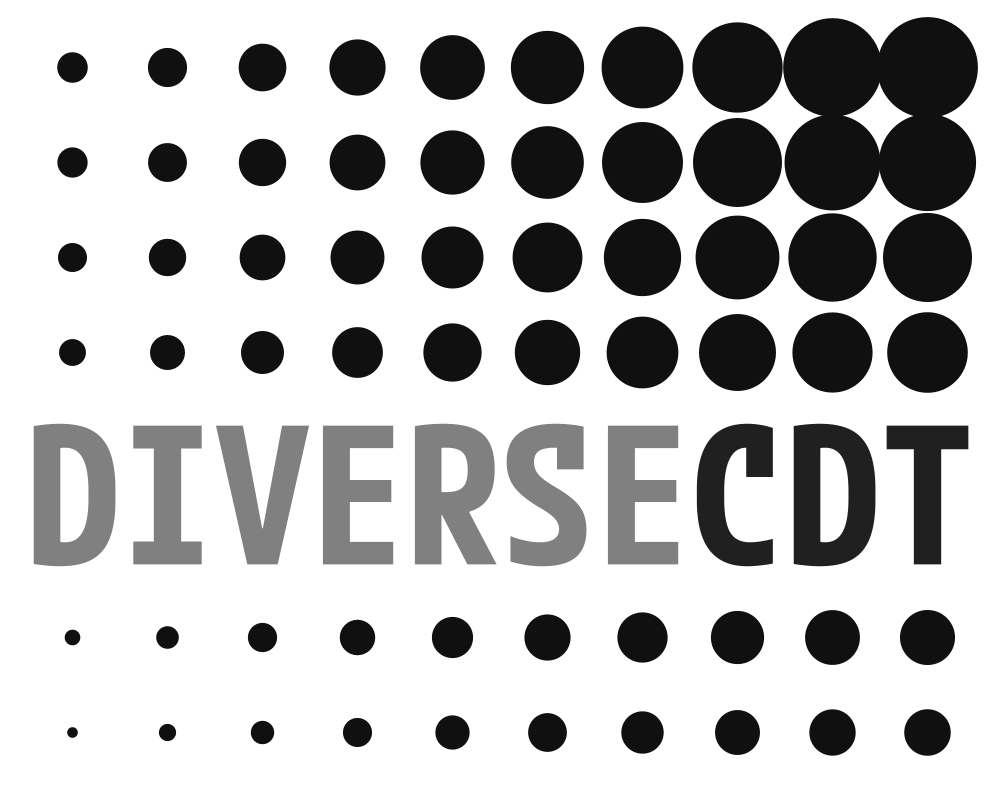
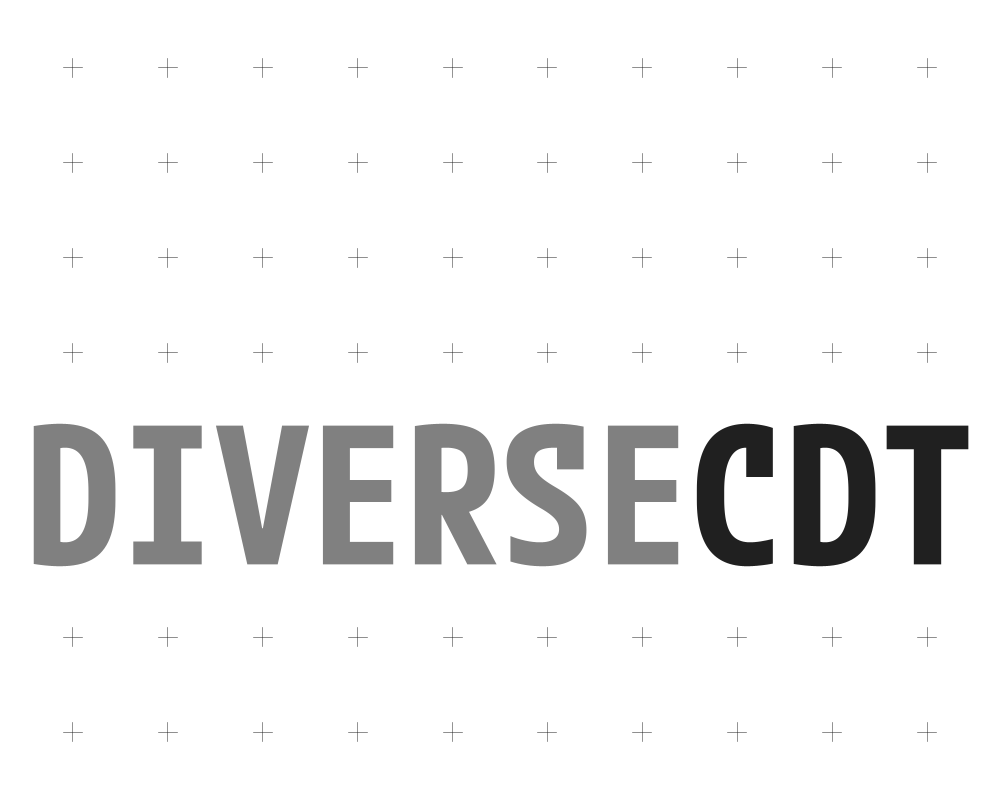
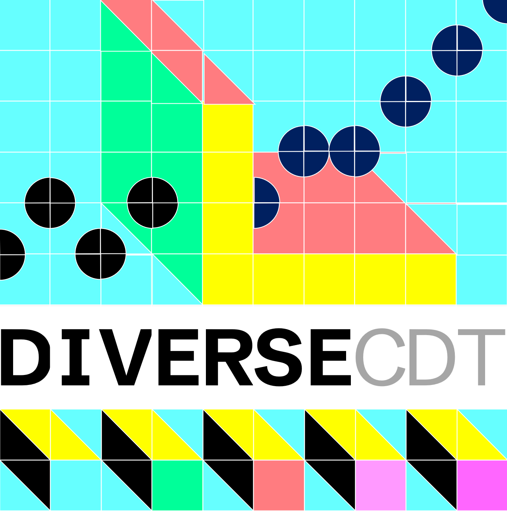

### DiVERSE-CDT Logo Grid - IDEAS &amp; REACTIONS

_We have been playing with logos that might emerge from the [LogoGrid](../logoGrid.html) idea as you know._

_Here we try to capture what we like and dislike about some of the examples / instances. Don't expect any agreement or convergence!_

---

#### Steph

###### LIKE

**Like** the pattern. It's coherent, not too much going on. The height of the font. Prefer the version with colour in the pattern rather than in the name.

###### LIKE / DISLIKE

**Like** the pattern. It's coherent, not too much going on. The height of the font.

**Dislike** the blank lines. The actual colours.

###### CONCERN

These examples might look very "solid" when used in context, e.g. on a web page. I really want to see examples of logos in context as this is a general concern. Or examples where the grid is less full.

How do they scale down, look in context?

###### LIKE

###### DISLIKE

Dislike the regular tiled ones such :  Toilet tiles!

###### DISLIKE

Looks skewed.

Dislike black and white (sorry Jason). 

---

#### Greg

###### LIKE

I **like** that even the plainest grid has its own merits…  e.g. a canvas that emphasises the text, an invitation to do use the grid, a suggestion that more is to come.
It is not my favourite, but I like the simpler forms.

###### LIKE

I **love** this great example of experiments leading to more experiments. If a design (system) encourages people to engage, play, discuss and share then its doing a lot of work, and has meme-like qualities.

###### DISLIKE

Dislike [the Typeface/Font](https://fonts.google.com/specimen/M+PLUS+1+Code).

Whilst this font is a placeholder for the valuable experiments with the grid, it has a couple of flourishes that are think are useful personal dislikes as they are informative for me to think about how plain (or not) the font should be.

The first is the semi sans down stroke flourish on the S and C (hope that makes sense). The second is the curve on the D and R which gives a slight rounding to the top. I do think the I, V, E and T are good!

###### PLUS

These were just quick sketches to see how it might work with one colour applied to a grid (a la pantone test cards), that grid cells could be divided up, that a simple optical illusions could be demonstrated through the logo (scintillating dots, and Mach bands).

---

#### Rachel

I agree with Greg on the positives/negatives of the font Jason used.

I also **like** that the font is relatively strong and equally weighted.

I **dislike** most of the examples with differently weighted or very light font.

I **love** Greg’s fluorescent one but the blue box in the bottom row second square from the left bugs me (as the only object that’s the same colour as the background!).

Agree with Jason about the ones that have clear tiles being good.

But I actually **like** a lot of the examples that both Greg and Jason have produced – including Greg’s pantone / monochrome experiments.

I **like** the lab-coloured rounded patterns ones (the pattern Jason described as having flow) but worry the logo might look too camouflage (and so military themed) if we go wholly with those colours.
(and so **dislike** the camo / military colour scheme)

 

I really do trust all of your judgement and am happy to see what emerges from tomorrow.

---

#### Jason

###### DISLIKE

I **like** this design a lot, which surprises me, but for me it shows how weak the lightness encoding is to dissociate DIVERSE and CDT, and I **DISLIKE** the lightness encoding used in the text.

This design makes it clear that it is easily compromised by other variation in the tiles.
We need different weights in our typeface family that enable us to dissociate DIVERSE from CDT in black and white only.  [Bebas Neue](https://fonts.google.com/specimen/Bebas+Neue) doesn't seem to have these.

So I **DISLIKE** the grey shading in the text here. The saturated hues and variation in lightness in the tiles cause visual conflict and compromise the dissociative properties of lightness.

###### LIKE

I **LIKE** this one as is seems to have flow.

But then I also like the various versions (such as the one above) where the tiles are more obvious.

I **DISLIKE** the lightness encoding in the text (see above).

I **LIKE** black and white, which seems very flexible, and to minimise conflicts with other aspects of design in the design space. 

I **LIKE** the character spacing the balance of black to white (&lt; 25% black looks clean) 

I agree that this is not the font to use - fussy, but we need a 2x1 with bold / black / options and these are limited.

---

    
**Jason**.
 _11/06/2025_
