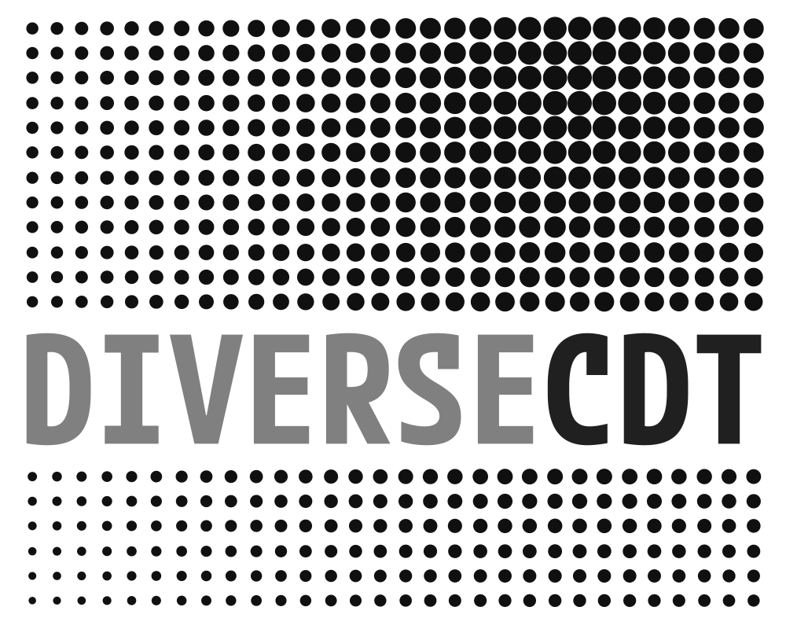
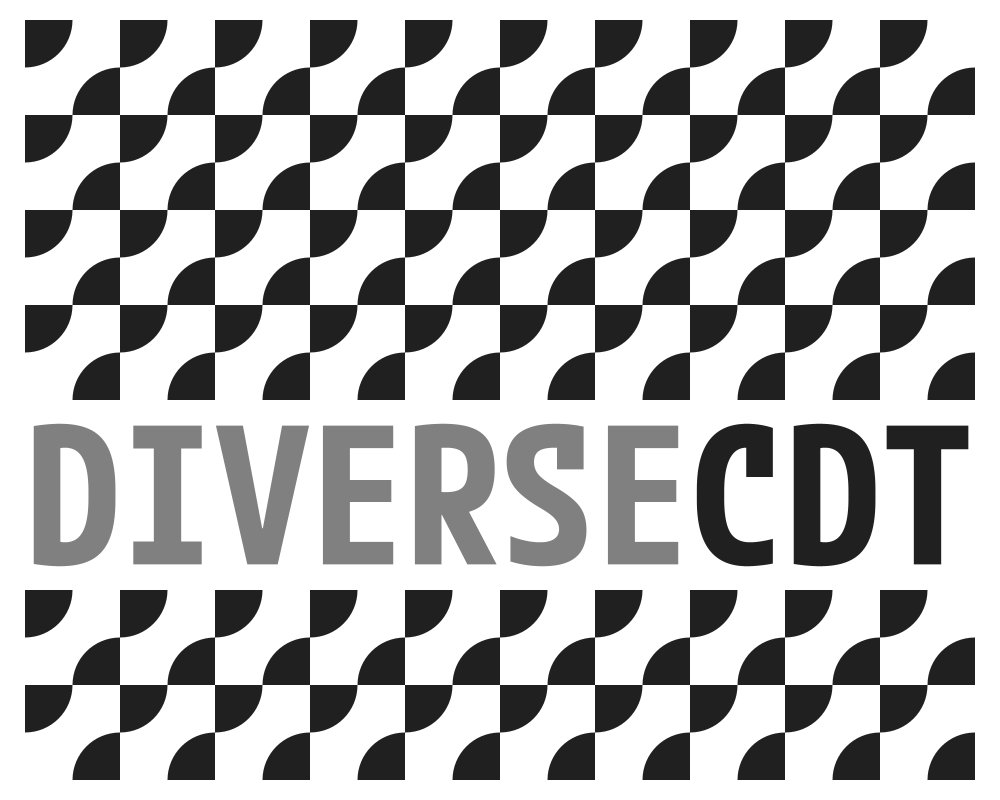
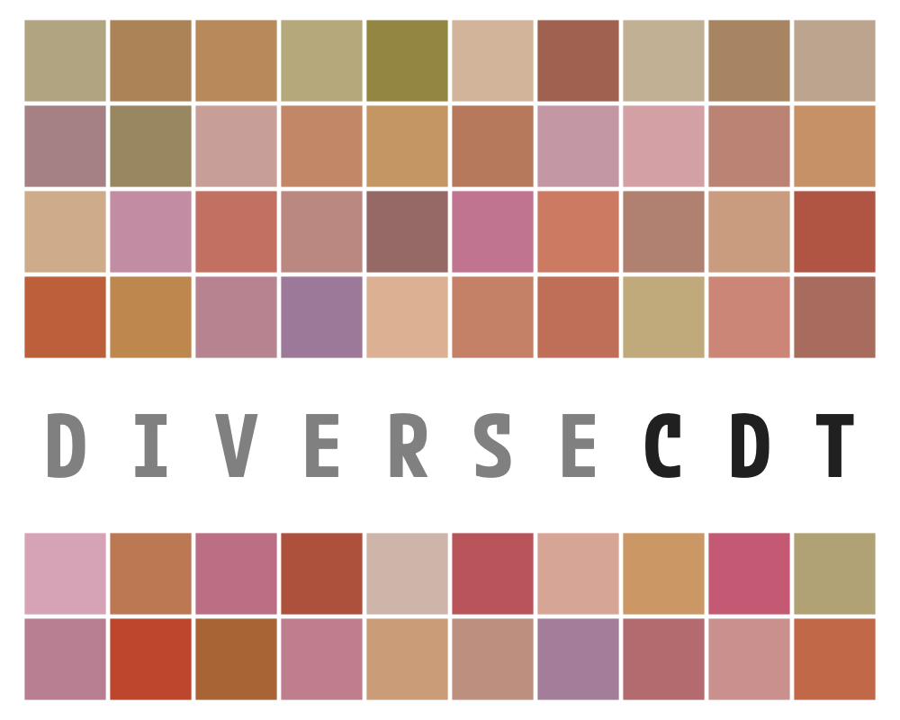
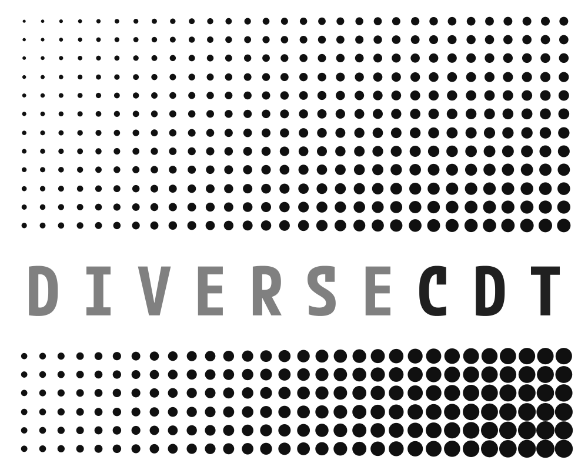

### DiVERSE-CDT Logo Grid

_Greg_ had an interesting idea on the back of discussions today.

He said something like ...

> Maybe the logo is just a canvas onto which we can hang data

and added something along the lines of ...

> This would enable us to be consistent and yet expressive and would be great for exploring visualization and teaching students

Or maybe I just imagined it?!

Anyhow, it would give us great flexibility, important recognisable stability and enable us to give students and other CDT members ownership of the branding whilst helping us achieve some of our values :

 - diverse
  - exploratory
   - playful

We came up with a 10x8 coordinate space, which is easy to make square with a margin top and bottom.

Two rows and 10 columns are taken up with our 10 letters, each letter is thus 2 cells high and 1 cell wide, so we need a tall font (approx 2:1 in h:w ratio).

 - [M PLUS 1 Code](https://fonts.google.com/specimen/M+PLUS+1+Code) seems to work pretty well, [other fonts are available](https://fonts.google.com/)

Here we see it with a cross showing the (60 - which is a nice number as we have one square per student) positions onto which we can plot data, and circle and square shapes showing the fillable spaces that each position represents.

Basically, the points at the centres of the circles or cells are the places where we can add whatever we like. :)

_Go creativity!_

#### TEXT

Could be numbers (raw data), text (messages), emojii ...any size, colour, font you like, all of which might vary.

 - [Major Mono Display](https://fonts.google.com/specimen/Major+Mono+Display) is an interesting choice here - we should have rules over which fonts we use (rights, sizing, [etc.](https://fonts.google.com/knowledge/choosing_type/a_checklist_for_choosing_type))

#### SIZE

We can vary and encode with size, shape, colour, etc.

Ooops - those last two broke the rules, with circles overlapping the text rows. Looks too cluttered - fixed below, cleaner.

#### ORIENTATION

And we can vary and encode with orientation.

And of course any of these lines can be any length and any width and any colour.

And dynamic - either animated or interactive.

  <video width="300" controls>
    <source src="diverseCDT.movingLogo.10.mov" type="video/mp4">
    Your browser does not support the video tag.
  </video>

Of course that's true of the examples above too ... gently, blatantly, reassuringly or disturbingly dynamic!

  <video width="300" controls>
    <source src="diverseCDT.movingLogo.06.mov" type="video/mp4">
    Your browser does not support the video tag.
  </video>

  <video width="300" controls>
    <source src="diverseCDT.movingLogo.07.mov" type="video/mp4">
    Your browser does not support the video tag.
  </video>

  <video width="300" controls>
    <source src="diverseCDT.movingLogo.08.mov" type="video/mp4">
    Your browser does not support the video tag.
  </video>

#### INTERACTION &amp; COMPOSITES

Shapes that interact to make composite shapes are interesting.

#### LENGTH

We can make bars of different length if we want to - through data driven presence or absence of a symbol in each cell.

Lines of different orientation have nice interaction effects.

  <video width="300" controls>
    <source src="diverseCDT.movingLogo.09.mov" type="video/mp4">
    Your browser does not support the video tag.
  </video>

Triangles - regular, in line with City branding ... or random to undermine it ...

Or resized with spacing ... 

  <video width="300" controls>
    <source src="diverseCDT.movingLogo.05.mov" type="video/mp4">
    Your browser does not support the video tag.
  </video>

#### COLOUR

Lots of options - here just with squares and standard gradients, but there are many possibilities.

Here with random colours from a more limited palette to get closer to Greg's examples.

And of course we can combine variations randomly or in light of data.

  <video width="300" controls>
    <source src="diverseCDT.movingLogo.04.mov" type="video/mp4">
    Your browser does not support the video tag.
  </video>

  <video width="300" controls>
    <source src="diverseCDT.movingLogo.11.mov" type="video/mp4">
    Your browser does not support the video tag.
  </video>

#### BUSY, CRAZY INTERACTIONS

And we can go crazy with busy shape interactions if we don't like sleep, many of these are inspired and informed by, if not directly lifted from, by Jo's _tiles_ examples from the City UG BootCamp ...

#### Square

Here's how it looks as a square, firstly with equal spacing top and bottom and then and with a bigger gap at the bottom to include the strapline.

#### Institution

I am sure we won't be allowed to do this, but I wish we could - add official logos in the 3x2 at the bottom right!

Actually, have decided that's pretty ugly and need to work on letter spacing there. Delete. Some experiments fail.

**UPDATE**: I broke the rules with the two above (by mistake) as the circles go into the blank rows for text - hence ugly!

#### Text Size

I'd want to play with text size and fonts a bit - legibility, white space, balance.

Need to check it at different sizes of reproduction.

A job for the designers maybe!

#### Long and Thin for Headers

Some quick experiments here on how we might use the same font with a different layout for a long / thin aspect ratio.

Using a 1:10 grid with half of the space (1:5) reserved for 10x 2:1 letters and half the space for 'data hooks' seems to work pretty well.

Here I put the letters 20% of the way along (cols 5-24 of 40).

The hooks are closer together here and so the tiles are half the size.
I think this probably looks OK?

 
 
 
 
 
 
 

Also note that I got things wrong above - I missed a column of hooks!
This is rectified below, but the font looked a bit squeezed so I reduced the size a little too. Then it needs lowering! This emphasizes the need for a clear, bold, stylish 1:2 font IMHO.

Rectified examples follow, this time with **60 hooks** ...

 
 
 
 
 
 
 
 
 
 
 

Including one that shows that I have been watching too much of the _[Giro d'Italia](https://www.cyclingnews.com/races/giro-d-italia-2025/stage-14/results/)_ ... 

 
 
   
   

And one that uses [PEmbroider](https://github.com/CreativeInquiry/PEmbroider/blob/master/README.md) to create a DST file for a programmable sewing machine, in line with the Warwick-based [Stitch in Time](https://warwick.ac.uk/fac/sci/wmg/about/outreach/resources/turtlestitch/stitchintime/) outreach work.

 
(Needs some work on the font).

Which _Margaret Low_ at Warwick [just stitched](https://photos.google.com/share/AF1QipPT_KhNCOJx32hjTwNqpf0cA5QA3tGc0TJGqSKrcGpQYESfEUsy7uSJFMniDhqvXQ/photo/AF1QipM5y2FJ2VlS4reN8_bXwBBycI6mGBwTluw-g7tF?key=bTF6bkRkby0wVUdaZFdLcEYwcl9Va3pUWV9hVnNn) for me!
 

### The Idea

OK - so _The Idea_ is that we have a space or canvas that we can fill in many ways to overcome the identity / expressiveness / ownership  / flexibility conundrum.

We could decide how many rules to apply, but could get _Creative Triangle_ to experiment a little and set these up.

We might for example go with ...

 1. a **10x8** grid
 2. **DIVERSECDT** in rows 5 and 6 of 8 with one letter in each column
 3. a specified **tall font** of specified size, weight and spacing
 4. perhaps specified letter **colouring** (perhaps with options) 
 5. don't f*ck with the letters (feedback!) - needs to be **readable**

 With _Creative Triangle_ to advise on 3 and 4 and come up with some cool examples that use and stretch and take advantage of these rules while giving us expressive and innovative visual identities that reflect our values and meet our accessibility responsibilities.

 **Thoughts**?

 ### HYPHEN Post-Script

 The thing I like least about this is ... "**SECDT**".

 Sounds like a _sect_ to me, which is not what we want to seem like. And I keep seeing it even if I change the colour of CDT.

Then I worry that a '**DIVER SECDT**' sounds a little too much like the kind of _Teutonic Scuba Cult_ I'd probably try to steer clear of. 

If we add the hyphen of my dreams we lose it but we end up with 11 columns and less squareness! 

---

    
**Jason**.
 _19/05/2025_
 _20/05/2025_
 _23/05/2025_
 _25/05/2025_
