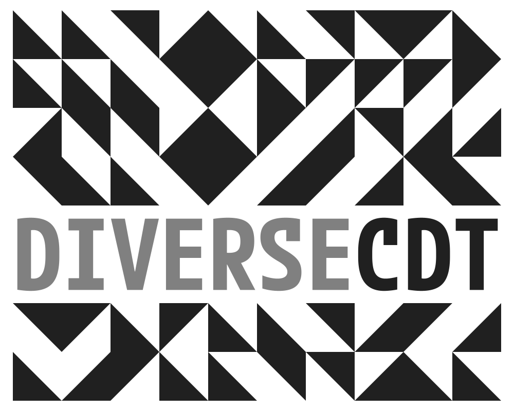

### DiVERSE-CDT Logo Grid

_Greg_ had an interesting idea on the back of discussions today.

He said something like ...

> Maybe the logo is just a canvas onto which we can hang data

and added something along the lines of ...

> This would enable us to be consistent and yet expressive and would be great for exploring visualization and teaching students

Or maybe I just imagined it?!

Anyhow, it would give us great flexibility, important recognisable stability and enable us to give students and other CDT members ownership of the branding whilst helping us achieve some of our values :

 - diverse
  - exploratory
   - playful

We came up with a 10x8 coordinate space, which is easy to make square with a margin top and bottom.

Two rows and 10 columns are taken up with our 10 letters, each letter is thus 2 cells high and 1 cell wide, so we need a tall font (approx 2:1 in h:w ratio).

 - [M PLUS 1 Code](https://fonts.google.com/specimen/M+PLUS+1+Code) seems to work pretty well, [other fonts are available](https://fonts.google.com/)

Here we see it with a cross showing the (60) positions onto which we can plot data, and circle and square shapes showing the fillable spaces that each position represents.

Basically, the points at the centres of the circles or cells are the places where we can add whatever we like. :)

_Go creativity!_

#### TEXT

Could be numbers (raw data), text (messages), emojii ...any size, colour, font you like, all of which might vary.

 - [Major Mono Display](https://fonts.google.com/specimen/Major+Mono+Display) is an interesting choice here - we should have rules over which fonts we use (rights, sizing, [etc.](https://fonts.google.com/knowledge/choosing_type/a_checklist_for_choosing_type))

#### SIZE

We can vary and encode with size, shape, colour, etc.

#### ORIENTATION

And we can vary and encode with orientation.

And of course any of these lines can be any length and any width and any colour.

And dynamic - either animated or interactive.

  <video width="300" controls>
    <source src="diverseCDT.movingLogo.10.mov" type="video/mp4">
    Your browser does not support the video tag.
  </video>

Of course that's true of the examples above too ... gently, blatantly, reassuringly or disturbingly dynamic!

  <video width="300" controls>
    <source src="diverseCDT.movingLogo.06.mov" type="video/mp4">
    Your browser does not support the video tag.
  </video>

  <video width="300" controls>
    <source src="diverseCDT.movingLogo.07.mov" type="video/mp4">
    Your browser does not support the video tag.
  </video>

  <video width="300" controls>
    <source src="diverseCDT.movingLogo.08.mov" type="video/mp4">
    Your browser does not support the video tag.
  </video>

#### INTERACTION &amp; COMPOSITES

Shapes that interact to make composite shapes are interesting.

 #### LENGTH

 We can make bars of different length if we want to - through data driven presence or absence of a symbol in each cell.

Lines of different orientation have nice effects.

  <video width="300" controls>
    <source src="diverseCDT.movingLogo.09.mov" type="video/mp4">
    Your browser does not support the video tag.
  </video>

Triangles - regular, in line with City branding ... 

or random to undermine it ...

Or ... 

  <video width="300" controls>
    <source src="diverseCDT.movingLogo.05.mov" type="video/mp4">
    Your browser does not support the video tag.
  </video>

#### COLOUR

Lots of options - here just with squares and standard gradients, but there are many possibilities.

Here with random colours from a more limited palette to get closer to Greg's examples.

And of course we can combine variations randomly or in light of data.

  <video width="300" controls>
    <source src="diverseCDT.movingLogo.04.mov" type="video/mp4">
    Your browser does not support the video tag.
  </video>

  <video width="300" controls>
    <source src="diverseCDT.movingLogo.11.mov" type="video/mp4">
    Your browser does not support the video tag.
  </video>

### The Idea

OK - so _The Idea_ is that we have a space or canvas that we can fill in many ways to overcome the identity / expressiveness / ownership  / flexibility conundrum.

We could decide how many rules to apply, but could get _Creative Triangle_ to experiment a little and set these up.

We might for example go with ...

 1. a 10x8 grid
 2. DIVERSECDT in rows 5 and 6 of 8 with one letter in each column
 3. a specified tall font
 4. specified letter colouring (perhaps with options) 

 With _Creative Triangle_ to advise on 3 and 4 and come up with some cool examples that use and stretch and take advantage of these rules while giving us expressive and innovative visual identities that reflect our values.

 Thoughts?

---

    
**Jason**.
 _19/05/2025_
