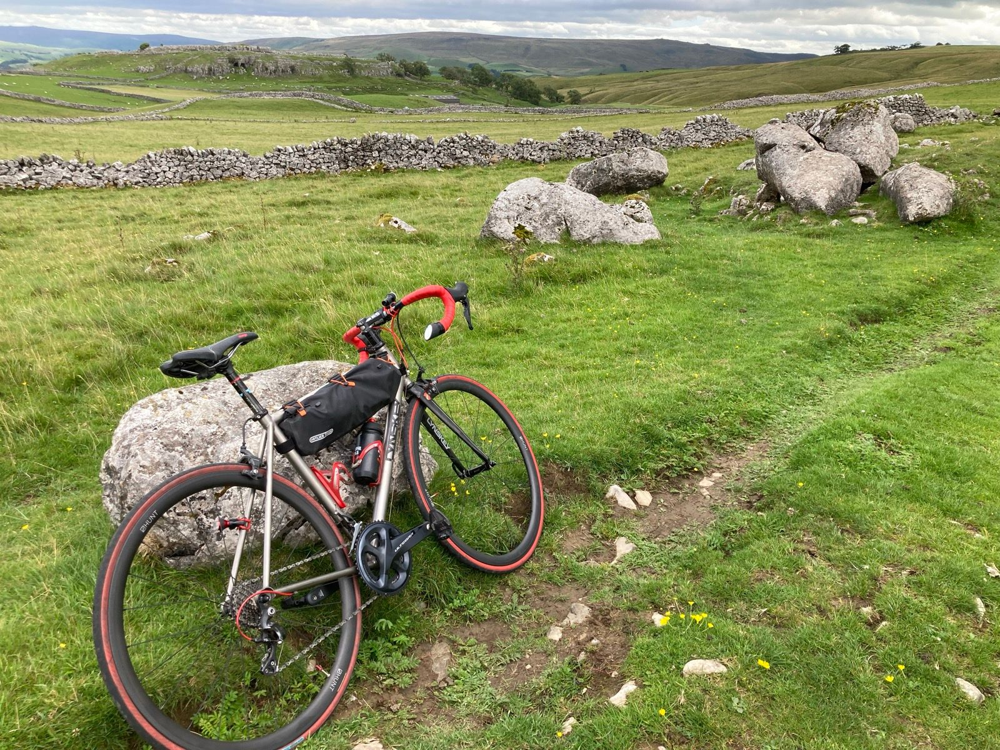
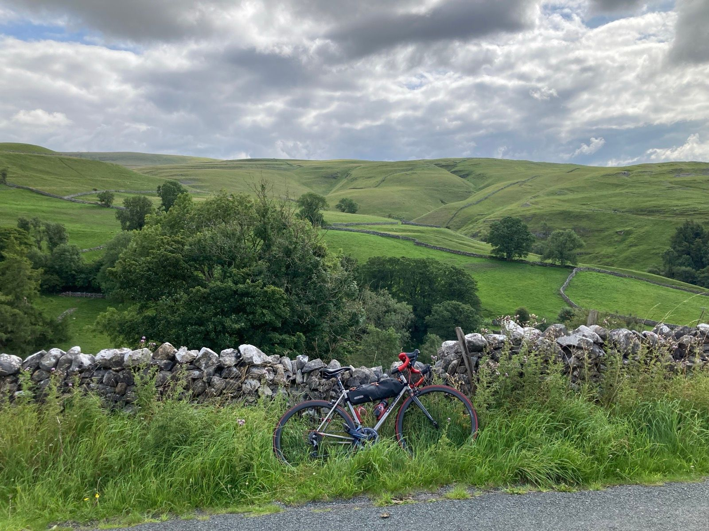
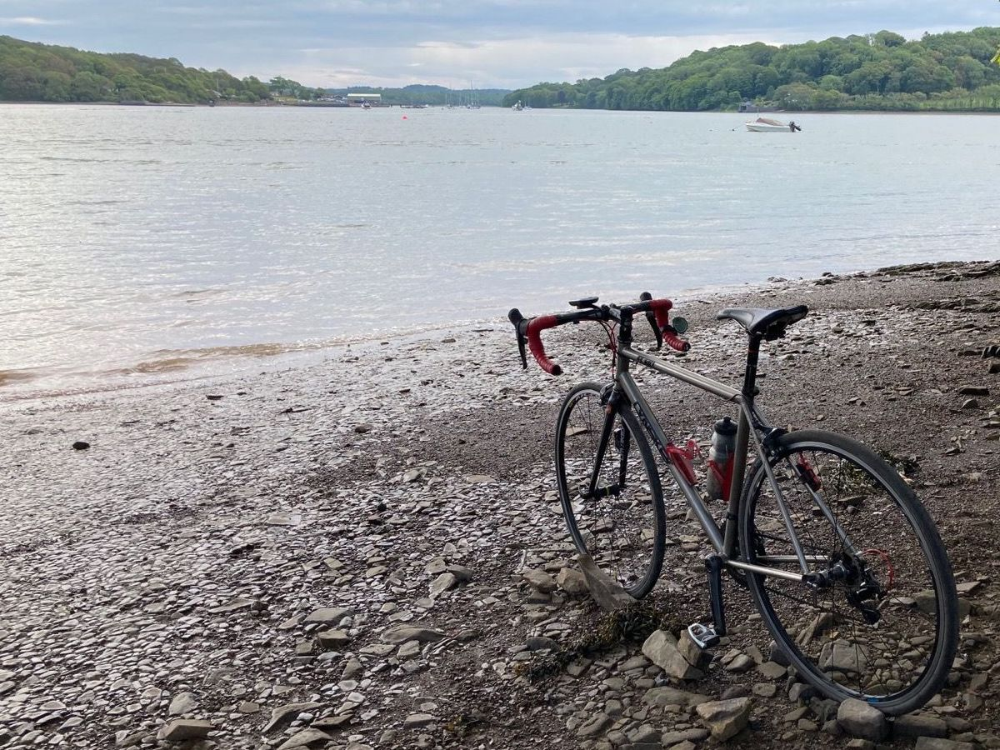
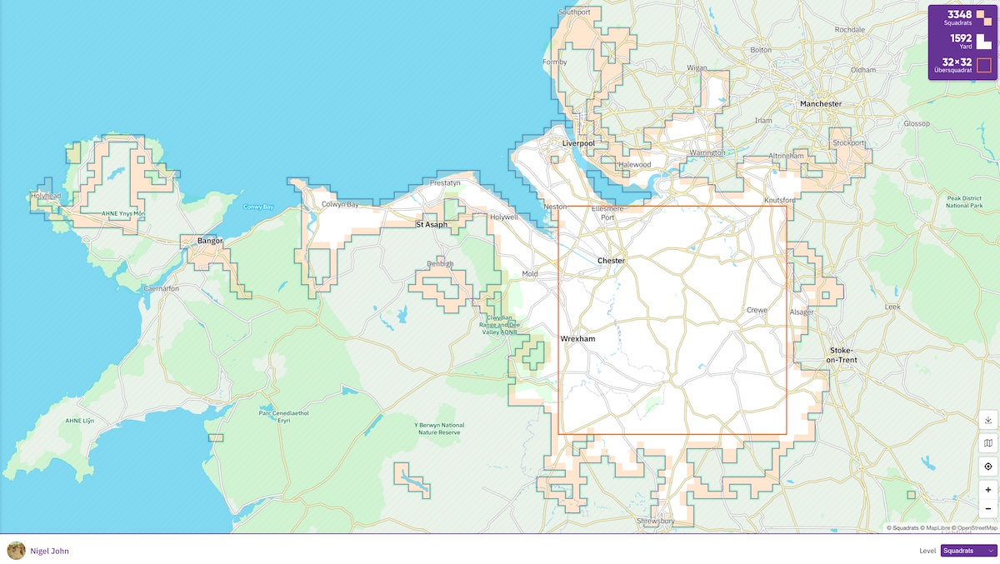
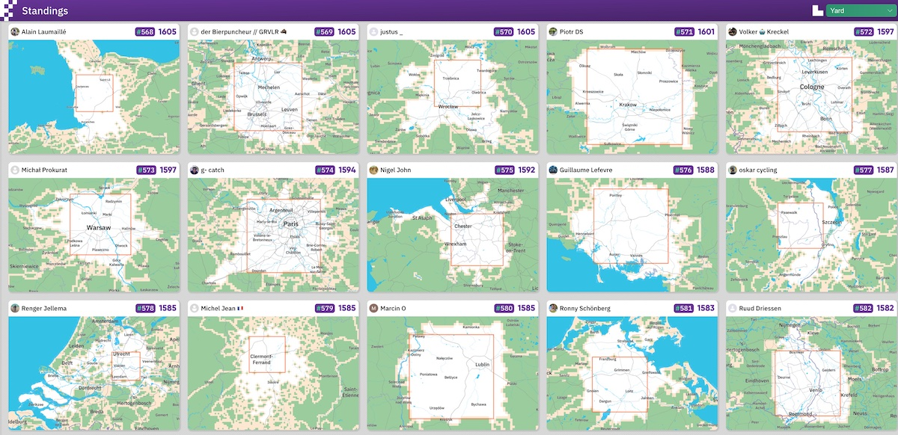

### Nigel John - Cyclist

I was shocked and terribly saddened to hear that we lost **Nigel John** on Saturday afternoon.
The awful news was communicated by colleagues at the University of Bangor.

I knew Nigel as a committed, competent, encouraging and inspiring cyclist and would like to share some of his exploits.
He regularly rode with the [CTC (Cyclists' Touring Club)](https://www.cyclinguk.org/) and actively sought out unexplored parts of the World, usually on his titanium Lynskey bike, which he would regularly prop up and photograph mid-ride.

Nigel shared much of _the former_, the riding, on [Strava](https://www.strava.com/athletes/2710835/) where had recorded more than 4,000km of cycling this year. His [2017 Infographic](https://www.strava.com/athletes/2710835/posts/1057442) showed that he had ridden on 229 days and covered 4,300 miles in 318 hours on the bike. This involved the equivalent of 5 ascents of Mount Everest. His [2022 highlights](https://www.strava.com/athletes/2710835/posts/23031166) showed that he was on the road on 276 of the days in the year - one of the top 2% most active on Strava. In total, [Nigel’s Strava](https://www.strava.com/athletes/2710835) shows **57,000km** of riding, involving **350km** of climbing (vertical ascent) and more than **2,700** hours in the saddle since 2013. This involves around four and a half hours of riding per week on average - mostly outdoors, but some on his trainer indoors.

He undertook _the latter_, the exploration, systematically, logging the ‘_squadrats_’ - squares of 1 mile by 1 mile - that he visited across the country. [Nigel visited **3,348 squadrats**](https://squadrats.com/map/awbf6rDqhgeIeNGBatbCJkk9TEz2), with an impressive ‘_yard_’ or footprint of **1,592** interconnected 1 mile squares. His _Übersquadrat_ - his largest square completely filled with visited smaller squares - is **32x32**, an area including that includes Ellesmere Port, Knutsford, Crewe, Market Drayton, Oswestry, Wrexham and Chirk.

He completed this with [a ride in Staffordshire this August](https://www.strava.com/activities/9666488445), and it puts him at **#575** in the standings at [squadrats.com](https://squadrats.com/standings).

Having followed Nigel’s exploits, and shared cycling experiences over the years - we both love the Severn Bridge run, we always give and share kudos after a ride - I suspect that Nigel might want to be remembered by the geographic footprint that he made with his bike. It's amazing.

I’ll miss him, and watching him develop this. 
But, what an achievement.

**Jason**.
 _18/10/2023_
