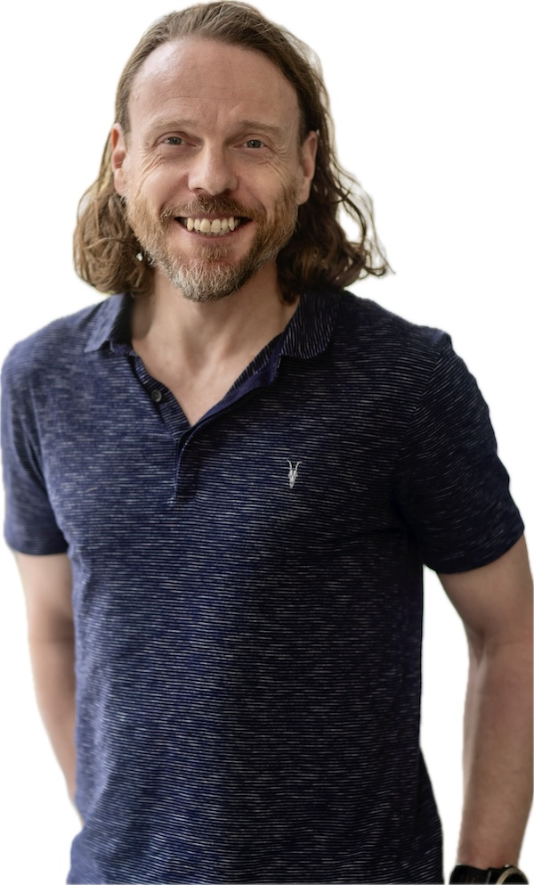

### DIVERSE-CDT PhotoShoot - October 2025

For what it's worth, I was very surprised that the photographer stood us against a window and in front of some vertical lines. 

This does weird things with face symmetry - _particularly if you have a massive nose_ (_Fig. 1_), and makes it hard to remove backgrounds - _particularly if you have fabulous hair_ (_Fig. 6_).

| 1 - original  | 2 - auto-enhance | 3 - vivid | 4 - noir | 5 - high contrast | 6 - cut-out|
|--|--|--|--|--|--|
|  |  |  |  |  |  |

The light from the side (left) is shining on the bigger half of my face and makes it look _even more massive_ than normal as the smaller right side of my face cowers away in the darkness (_Fig. 1_). I can live with this, but ...

This is rectified (in the photo at least) with an _Apple Photos_ basic '_auto-enhance_'filter (_Fig. 2_)

These filters work superbly ... and I think we should at least consider them and probably use them _consistently_ for a '_look_'.

I'm happy to take advice on this but, FWIW, _vivid_ makes us look young, energised and healthy (_Fig. 3_).

_Noir_ is nicely dramatic and also compliant as B/W removes clothing colour errr ... diversity (_Fig. 4_).

I quite like an _overexposed_ look with high _shadow_ and _contrast_ as it removes blemishes and detail from those who do not have the skin of supermodels(_Fig. 5_).

I will leave this to the Photo/Brand lead, but do hope that we achieve some consistency in all of this.

J.