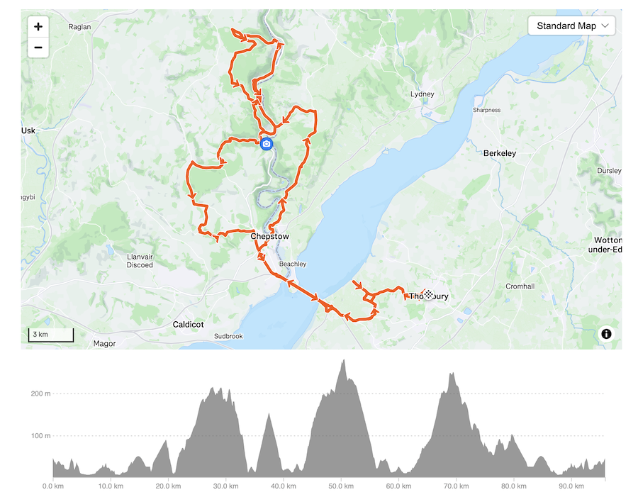

## Wye 95km

_Ride from Thornbury into and out of the Wye Valley (perhaps twice) includes a couple of my favourite climbs, a couple of my favourite cafés and a couple of my favourite deceased relatives ..._ 

 * [https://www.strava.com/routes/3364650371818513954](https://www.strava.com/routes/3364650371818513954)

---

### Instructions and Points of Interest

#### 6km Levee
It's always worth a trip to the river at _Littleton_, just head up onto the levee to look at the bridge and see where you're heading

#### 13.5km Toll Booth
I always ride across the bridge over the motorway here, nice view of the bridge, sun behind you so shadows often and fall on the road. A good place for a quick drink.

#### 21km Chepstow Castle
Stop here - the castle is breathtaking, and after a photo or two roll out of the car park and left into ...

#### 21.1km Pannevino
Very good coffee, excellent bruschetta, opens at 11 AM.
You guys go out early, but I usually time my ride so that I get here for opening time. It's an hour from _Thornbury_.
You can sit by the street with the bikes, or head into to the café and sit out the back by the river. Both are excellent. You are right by the river here so it's important to get some caffeine in you before the long climb ahead!

#### 21.2km Wye Bridge
Love the bridge into _England_. Remember to look back left over your shoulder at the castle as you head over, while concurrently watching out for oncoming traffic!
The climb to _Tutshill_ is sharp and I used to do this on a [Raleigh Europa](https://road.cc/content/blog/tales-10-speed-racer-279649) in jeans as a kid!
But the climb from [Wye to Tidenham](https://www.strava.com/segments/39314918) is a glorious 200m ascent over 6.25km (if you can avoid the traffic!)

#### 23.75km Wintour’s Leap
You are on a cliff edge here. Stop at the side of the road in one of the little alcoves to see the _Wye_ and how high you have climbed.
Remember to look right to see _The River_ and _Thornbury_ as you climb.

#### 26.75 Tidenham Chase
You are nearly at the top of the climb now, and it's worth just going a few hundred yards down any of the lanes into the Woodland to enjoy the foliage and hear the bird song.

#### 30.75 Hewelsfield
Take the descent steady, enjoy the views, this secret valley down into _Brockweir_ is magical.

#### 34km Wye
Now, when you get to the _Brockweir_, you can just cycle home, but I've put in an extra loop because now you're here… well, it's the _Wye Valley_!

#### 35km Right!
Take a right here for the extra loop into the Woodland up and down to _Llandogo_.
Ignore it of you want to get back earlier having seen less!

#### 41.5km
A kind of secret road that takes you up a lovely climb out of the main valley through _Whitebrook_.

#### 56km Llandogo Again
It's a nice descent. Feels like the redwoods of _California_ and _British Columbia_ to me. Enjoy it again!

#### 61.5km Wye
Take a look at the railway bridge.

#### 62km The Filling Station
My favorite café. They really understand coffee here so make sure your order is precise. Enjoy the cycling fair and grab a toasted sandwich and some flapjack. I usually have one flapjack here ready for the climb, and put another one in my back pocket to eat at the top when I get to _Devauden_!

#### 62.5km Fave Climb - Forge Road / Fawr Anghidi
Love it up here … from the drain by the roadside, past the ponds, through the streams and meadows, with wood anemones and garlic in the hedgerows in the springtime, around the virages and the beech woods, up to _Devauden_. The main road can be busy and the final 400m is steep, but it’s a great run!

#### 69km Devauden
My Great uncle lived here when I was a kid, we used to cycle over. He had a house in the village when he was older, but originally lived in a white farmhouse, which is just out of the village on the right on the north on the way to _Trellech_. I won't make you pedal along there, but I usually do just for all-time sakes. Eat that flapjack. 

#### 69.5km Descent
Good views of the _Black Mountains_ as you look right.

#### 73.5km Itton Church
So, Uncle Iko and Aunt Alice are buried here .. I often stop by. Pretty church!

#### 79km Busy Chepstow
A main road. Take it on the chin. Use the pavements. Go careful.

#### 82.75km The Bridge
It feels as though you're going to end up on the motorway here, but don't worry, just follow the track and you will end up on the cycle path!

#### 95km Cemetery
My Dad is buried here, so I usually pop in - again, no need!

---
### Previous Rides :

You can see some of this stuff logged here on previous rides ...

 * [https://www.strava.com/activities/9162651000](https://www.strava.com/activities/9162651000)
 * [https://www.strava.com/activities/10194135570](https://www.strava.com/activities/10194135570)
 * [https://www.strava.com/activities/7104373169](https://www.strava.com/activities/7104373169)

---

Jason **DYKES** 
02/06/2025